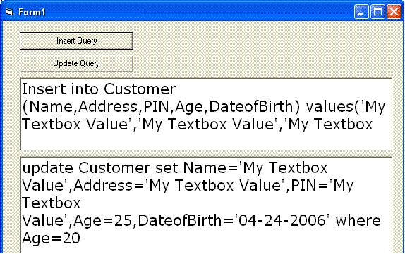

<div align="center">

## Creating SQL Query Automatic Insert/Update query


</div>

### Description

Creating Insert/Update queries automatically, Date, Text, Number fields handled, Very useful. download it

<a href="http://www.ixwebhosting.com/templates/ix/v2/affiliate/clickthru.cgi?id=mahvisions"></a>
 
### More Info
 


<span>             |<span>
---                |---
**Submitted On**   |2006-04-24 08:06:00
**By**             |[deepgags](https://github.com/Planet-Source-Code/PSCIndex/blob/master/ByAuthor/deepgags.md)
**Level**          |Advanced
**User Rating**    |4.0 (8 globes from 2 users)
**Compatibility**  |VB 5\.0, VB 6\.0, VB Script, ASP \(Active Server Pages\) , VBA MS Access
**Category**       |[VB function enhancement](https://github.com/Planet-Source-Code/PSCIndex/blob/master/ByCategory/vb-function-enhancement__1-25.md)
**World**          |[Visual Basic](https://github.com/Planet-Source-Code/PSCIndex/blob/master/ByWorld/visual-basic.md)
**Archive File**   |[Creating\_S1989434232006\.zip](https://github.com/Planet-Source-Code/deepgags-creating-sql-query-automatic-insert-update-query__1-65103/archive/master.zip)

### API Declarations

```
Dim SQLInsert As New SqlQuery
Private Sub Command1_Click()
SQLInsert.ClearString
SQLInsert.InsertSQL "Name", CharacterField, "My Textbox Value"
SQLInsert.InsertSQL "Address", CharacterField, "My Textbox Value"
SQLInsert.InsertSQL "PIN", CharacterField, "My Textbox Value"
SQLInsert.InsertSQL "Age", NumericField, 25
SQLInsert.InsertSQL "DateofBirth", DateField, Date
SQLInsert.SQLBuild "Customer", InsertData
Text1.Text = SQLInsert.GetSQL_String
End Sub
Private Sub Command2_Click()
SQLInsert.ClearString
SQLInsert.UpdateSQL "Name", CharacterField, "My Textbox Value"
SQLInsert.UpdateSQL "Address", CharacterField, "My Textbox Value"
SQLInsert.UpdateSQL "PIN", CharacterField, "My Textbox Value"
SQLInsert.UpdateSQL "Age", NumericField, 25
SQLInsert.UpdateSQL "DateofBirth", DateField, Date
SQLInsert.UpdateSQLWhere "Age", NumericField, 20
SQLInsert.SQLBuild "Customer", UpdateData
Text2.Text = SQLInsert.GetSQL_String
End Sub
```


